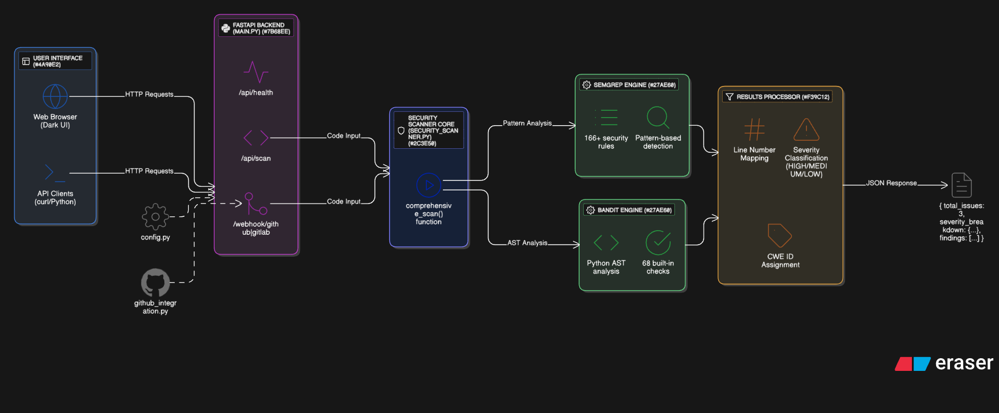

# NeuroCode - Python Security Scanner

**Live Demo:** [https://web-production-15a1.up.railway.app](https://web-production-15a1.up.railway.app)

A production-ready static application security testing (SAST) tool that analyzes Python code for security vulnerabilities using industry-standard Semgrep and Bandit engines. NeuroCode provides real-time vulnerability detection through an intuitive web interface and REST API, designed for developers and security teams.

---

## Table of Contents

- [Overview](#overview)
- [Key Features](#key-features)
- [Demo](#demo)
- [Architecture](#architecture)
- [Detection Capabilities](#detection-capabilities)
- [Installation](#installation)
- [Configuration](#configuration)
- [Usage](#usage)
  - [Web Interface](#web-interface)
  - [REST API](#rest-api)
  - [CI/CD Integration](#cicd-integration)
- [Project Structure](#project-structure)
- [Deployment](#deployment)
- [Performance](#performance)
- [Security Considerations](#security-considerations)
- [Limitations](#limitations)
- [Future Enhancements](#future-enhancements)
- [Contributing](#contributing)
- [License](#license)
- [References](#references)
- [Author](#author)

---

## Overview

NeuroCode combines two industry-standard security scanning engines—Semgrep and Bandit—to provide comprehensive Python code analysis. The platform serves multiple use cases: manual code review through a web interface, automated pull request scanning via webhooks, and programmatic integration through a REST API.

Unlike general-purpose AI tools like ChatGPT, NeuroCode is purpose-built for enterprise security requirements with deterministic scanning, audit trail support, self-hosting capabilities, and zero data leakage. The tool runs entirely within your infrastructure, ensuring compliance with SOC 2, ISO 27001, and other regulatory frameworks.

### Why NeuroCode?

**Enterprise-Grade Security**
- Self-hosted deployment with no external data transmission
- Deterministic results ensuring consistency across scans
- Audit trail support for compliance requirements
- HMAC signature verification for webhook security

**Developer-Friendly**
- Real-time feedback with sub-3-second scan times
- Line-level precision with exact vulnerability locations
- Severity-based categorization (HIGH/MEDIUM/LOW)
- CWE and CVE mapping for standardized reporting

**Automation-Ready**
- REST API for programmatic access
- GitHub/GitLab webhook integration
- Background task processing for large codebases
- JSON response format for easy parsing

---

## Key Features

### Multi-Engine Scanning

**Semgrep Engine**
- Pattern-based vulnerability detection using 166+ security rules
- Supports OWASP Top 10 vulnerability patterns
- Language-agnostic rule engine with Python-specific optimizations
- Low false-positive rate through precise pattern matching

**Bandit Engine**
- Python AST (Abstract Syntax Tree) analysis
- 68 built-in security checks for Python-specific issues
- CWE (Common Weakness Enumeration) mapping
- Detects runtime security issues and code smells

**Combined Analysis**
- Dual-engine approach provides broader coverage than single-tool solutions
- Deduplication logic removes redundant findings
- Aggregated severity scoring across both engines
- Comprehensive reporting with detailed remediation guidance

### Web Interface

- **Dark-Themed UI**: Modern, responsive interface optimized for developer workflows
- **Real-Time Analysis**: Instant vulnerability detection with <3 second scan times
- **Syntax Highlighting**: Code editor with Python syntax highlighting
- **Interactive Results**: Expandable vulnerability cards with severity badges
- **Line-Level Precision**: Exact line numbers and code snippets for each finding
- **Severity Filtering**: Quick filtering by HIGH/MEDIUM/LOW severity levels

### REST API

**Core Endpoints**
- `POST /api/scan` - Submit code for vulnerability scanning
- `GET /api/health` - Health check with scanner status
- `POST /webhook/github` - GitHub pull request webhook handler
- `POST /webhook/gitlab` - GitLab merge request webhook handler

**API Features**
- JSON request/response format
- Structured error handling with HTTP status codes
- CORS enabled for frontend integration
- Rate limiting support (configurable)
- Async processing for large scans

**Example Request**
curl -X POST https://web-production-15a1.up.railway.app/api/scan
-H "Content-Type: application/json"
-d '{
"code": "query = "SELECT * FROM users WHERE id = " + user_id",
"language": "python"
}'  

**Example Response**
{
"success": true,
"results": {
"total_issues": 1,
"severity_breakdown": {
"high": 0,
"medium": 1,
"low": 0
},
"semgrep_findings": [],
"bandit_findings": [
{
"test_id": "B608",
"issue_severity": "MEDIUM",
"issue_text": "Possible SQL injection vector through string-based query construction",
"line_number": 1,
"code": "query = "SELECT * FROM users WHERE id = " + user_id"
}
]
}
}

### CI/CD Integration

**Webhook Infrastructure**
- HMAC-SHA256 signature verification for security
- GitHub pull request auto-scanning
- GitLab merge request support (experimental)
- Background task processing with FastAPI
- Configurable scan timeout and file limits

**Supported Platforms**
- GitHub Actions (via webhook or API)
- GitLab CI (via webhook or API)
- Jenkins (via REST API)
- CircleCI (via REST API)
- Any CI/CD tool supporting HTTP requests

**Integration Architecture**
Pull Request → Webhook → NeuroCode → Scan → Post Comment/Status

---

## Demo

Experience NeuroCode in action with our live demo:

**Try it now:** [https://web-production-15a1.up.railway.app](https://web-production-15a1.up.railway.app)

**Sample vulnerable code to test:**
import os

SQL Injection
user_id = input()
query = "SELECT * FROM users WHERE id = " + user_id

Command Injection
os.system("ping " + host)

Hardcoded Credentials
PASSWORD = "admin123"
API_KEY = "sk_live_abc123"

**Expected results:** 3-4 vulnerabilities detected (1 HIGH, 1 MEDIUM, 2 LOW)

---

## Architecture

NeuroCode follows a layered architecture with clear separation of concerns:

### Component Breakdown

**Layer 1: User Interface**
- Web Browser: Dark-themed UI with code editor
- API Clients: curl, Python scripts, CI/CD tools

**Layer 2: API Gateway (main.py)**
- FastAPI backend handling HTTP requests
- Endpoints: `/api/scan`, `/api/health`, `/webhook/*`
- Request validation and error handling

**Layer 3: Scanner Core (security_scanner.py)**
- `comprehensive_scan()` orchestration function
- Manages scanner lifecycle and configuration
- Aggregates results from multiple engines

**Layer 4: Scanning Engines**
- Semgrep: Pattern-based detection (166+ rules)
- Bandit: Python AST analysis (68 checks)
- Parallel execution for performance

**Layer 5: Results Processor**
- Severity classification (HIGH/MEDIUM/LOW)
- Line number mapping
- Deduplication logic
- CWE ID assignment

**Layer 6: Output**
- Structured JSON response
- Frontend-ready format
- API-consumable structure

---

## Detection Capabilities

NeuroCode identifies 8+ categories of security vulnerabilities with CWE mapping:

| Vulnerability Type | CWE ID | Severity | Detection Engine | Example |
|--------------------|--------|----------|------------------|---------|
| SQL Injection | CWE-89 | HIGH/MEDIUM | Bandit, Semgrep | String concatenation in SQL queries |
| Command Injection | CWE-78 | HIGH | Bandit | `os.system()`, `subprocess.call()` with user input |
| Code Injection | CWE-94 | HIGH | Bandit, Semgrep | `eval()`, `exec()` with untrusted data |
| Hardcoded Credentials | CWE-798 | MEDIUM/LOW | Bandit | Passwords, API keys in source code |
| Weak Cryptography | CWE-327 | MEDIUM | Bandit, Semgrep | MD5, SHA1, weak ciphers |
| Insecure Deserialization | CWE-502 | HIGH | Bandit | `pickle.loads()` on user data |
| Path Traversal | CWE-22 | MEDIUM | Semgrep | Unvalidated file path operations |
| Flask Debug Mode | CWE-489 | LOW | Bandit | `debug=True` in production |

### Vulnerability Examples

**SQL Injection (B608 - MEDIUM)**
Vulnerable
query = f"SELECT * FROM users WHERE id = {user_id}"

Secure
query = "SELECT * FROM users WHERE id = ?"
cursor.execute(query, (user_id,))

**Command Injection (B605 - HIGH)**
Vulnerable
os.system(f"ping {host}")

Secure
subprocess.run(["ping", host], check=True)

**Hardcoded Credentials (B105 - LOW)**
Vulnerable
PASSWORD = "admin123"

Secure
PASSWORD = os.getenv("DATABASE_PASSWORD")

---

## Installation

### Prerequisites

- **Python**: 3.11 or higher
- **pip**: Latest version
- **Git**: For cloning repository
- **OS**: Linux, macOS, Windows (with WSL2)

### Local Setup

**1. Clone the repository**
git clone https://github.com/Yashwanth2408/neurocode.git
cd neurocode

**2. Create virtual environment**
python -m venv venv

Linux/macOS
source venv/bin/activate

Windows
venv\Scripts\activate

**3. Install dependencies**
pip install -r requirements.txt

**4. Verify installation**
python test_setup.py

Expected output:
✅ Semgrep installed and working
✅ Bandit installed and working
✅ FastAPI configured correctly

**5. Start the application**
python main.py

**6. Access web interface**
http://localhost:8000

---

## Configuration

NeuroCode uses environment variables for configuration. Create a `.env` file in the project root:

### Basic Configuration

Scanner Settings
ENABLE_SEMGREP=true
ENABLE_BANDIT=true
ENABLE_AI_ANALYSIS=false

API Server
API_HOST=0.0.0.0
API_PORT=8000

### GitHub Integration (Optional)

GitHub Personal Access Token
Required permissions: repo (for private repos), write:discussion
GITHUB_TOKEN=ghp_your_token_here

Webhook Secret (generate with: openssl rand -hex 20)
GITHUB_WEBHOOK_SECRET=your_webhook_secret_here  

### GitLab Integration (Optional)

GitLab Personal Access Token
Required permissions: api, read_repository
GITLAB_TOKEN=glpat-your_token_here

GitLab Instance URL (default: https://gitlab.com)
GITLAB_URL=https://gitlab.com

Webhook Secret
GITLAB_WEBHOOK_SECRET=your_webhook_secret_here

### Performance Tuning

Maximum file size to scan (KB)
MAX_FILE_SIZE_KB=500

Maximum files to scan per PR/MR
MAX_FILES_PER_PR=50

Scan timeout (seconds)
SCAN_TIMEOUT_SECONDS=300

### Configuration File Reference

Use `.env.example` as a template:
cp .env.example .env
nano .env # Edit configuration

---

## Usage

### Web Interface

**1. Access the application**
Navigate to `http://localhost:8000` (local) or your deployed URL

**2. Paste code**
Use the dark-themed code editor to paste your Python code

**3. Click "Scan Python Code"**
Initiate the security scan

**4. Review results**
Vulnerabilities appear with:
- Severity badges (HIGH/MEDIUM/LOW)
- Detailed descriptions
- Exact line numbers
- CWE/CVE references
- Remediation guidance

### REST API

**Health Check**
curl https://web-production-15a1.up.railway.app/api/health

Response:
{
"service": "NeuroCode Security Scanner",
"status": "running",
"version": "1.0.0",
"scanners": {
"semgrep": true,
"bandit": true,
"codellama_ai": false
}
}

**Manual Code Scan**
curl -X POST https://web-production-15a1.up.railway.app/api/scan
-H "Content-Type: application/json"
-d '{
"code": "import os\nos.system(user_input)",
"language": "python"
}'

**Python Integration Example**
import requests

def scan_code(code):
response = requests.post(
"https://web-production-15a1.up.railway.app/api/scan",
json={"code": code, "language": "python"}
)
return response.json()

Usage
results = scan_code("query = 'SELECT * FROM users WHERE id = ' + user_id")
print(f"Found {results['results']['total_issues']} issues")

### CI/CD Integration

#### GitHub Actions

**Configure Webhook**
1. Go to repository **Settings → Webhooks → Add webhook**
2. **Payload URL**: `https://your-domain.com/webhook/github`
3. **Content type**: `application/json`
4. **Secret**: Enter your `GITHUB_WEBHOOK_SECRET`
5. **Events**: Select "Pull requests"
6. Click **Add webhook**

**Alternative: API Integration**

Create `.github/workflows/security-scan.yml`:
name: Security Scan

on:
pull_request:
types: [opened, synchronize]

jobs:
scan:
runs-on: ubuntu-latest
steps:
- uses: actions/checkout@v3

  - name: Scan with NeuroCode
    run: |
      curl -X POST https://your-domain.com/api/scan \
        -H "Content-Type: application/json" \
        -d "{\"code\":\"$(cat your_file.py)\",\"language\":\"python\"}"

#### GitLab CI

Create `.gitlab-ci.yml`:
security_scan:
stage: test
script:
- |
curl -X POST https://your-domain.com/api/scan
-H "Content-Type: application/json"
-d "{"code":"$(cat your_file.py)","language":"python"}"
only:
- merge_requests

#### Jenkins

pipeline {
agent any
stages {
stage('Security Scan') {
steps {
script {
def code = readFile('your_file.py')
def response = sh(
script: """
curl -X POST https://your-domain.com/api/scan
-H "Content-Type: application/json"
-d '{"code":"${code}","language":"python"}'
""",
returnStdout: true
)
echo response
}
}
}
}
}

## Performance

### Scan Times

Code less than 100 lines: Semgrep 1-2s, Bandit <1s, Total 2-3s (Typical single file). Code 100-500 lines: Semgrep 2-5s, Bandit 1-2s, Total 3-7s (Module-level scan). Code 500-1000 lines: Semgrep 5-10s, Bandit 2-3s, Total 7-13s (Large file). Code 1000+ lines: Semgrep 10-15s, Bandit 3-5s, Total 13-20s (Very large file).

### Optimization Tips

**1. File Size Limits** - MAX_FILE_SIZE_KB=500 to skip files larger than 500KB

**2. PR Scope Limits** - MAX_FILES_PER_PR=50 to limit files scanned per PR

**3. Timeout Configuration** - SCAN_TIMEOUT_SECONDS=300 for 5 minute timeout

**4. Concurrent Scanning** - Semgrep and Bandit run in parallel for optimal performance

### Scaling Considerations

**Horizontal Scaling** - Deploy multiple instances behind load balancer. Stateless design enables easy scaling. Background task queue for large scans.

**Resource Requirements** - CPU: 1-2 cores (moderate load). Memory: 512MB - 1GB. Storage: less than 100MB (minimal).

## Security Considerations

### Best Practices

**1. Token Management** - Use GitHub/GitLab tokens with minimal permissions. Store tokens in environment variables, never in code. Rotate tokens periodically (every 90 days).

**2. Webhook Security** - Always configure webhook secrets. Verify HMAC signatures on all webhook requests. Use HTTPS for all webhook URLs.

**3. Deployment Security** - Deploy behind HTTPS/TLS. Use environment variables for sensitive configuration. Enable rate limiting in production. Regular security updates for dependencies.

**4. Data Privacy** - Code scanned locally within your infrastructure. No data sent to external services. Self-hosted deployment maintains complete privacy. Compliant with GDPR, CCPA, SOC 2.

### Webhook Signature Verification

NeuroCode automatically verifies webhook signatures: GitHub uses HMAC-SHA256 with X-Hub-Signature-256 header. GitLab uses secret token matching with X-Gitlab-Token header.

## Limitations

**Current Limitations:** 1. Python Only - Currently supports Python code analysis (multi-language support planned). 2. File Size - Maximum 500KB per file (configurable). 3. Public URL Required - Webhooks need publicly accessible endpoint (use ngrok for local testing). 4. AI Analysis - Disabled in production (optional Ollama integration available for local use).

**Known Issues:** False positives may occur in complex code patterns. Some framework-specific security issues may be missed. Large monorepos (10,000+ files) may require optimization.

**Workarounds:** Use .gitignore-style patterns to exclude test files. Configure MAX_FILES_PER_PR for large repositories. Review scan results manually before taking action.

## Future Enhancements

**Planned Features:** Multi-Language Support for JavaScript, TypeScript, Java, Go. Report Generation with PDF/HTML vulnerability reports. JIRA Integration for automatic issue creation from findings. Historical Tracking for vulnerability trends over time. Custom Rule Builder with UI for creating organization-specific rules. Slack/Email Notifications for real-time alerts on critical findings. Dashboard for analytics and metrics visualization. IDE Plugins for VS Code and PyCharm integration. Compliance Reports with SOC 2 and PCI-DSS formatted reports.

**Contribution Ideas:** See CONTRIBUTING.md for ways to contribute

## Contributing

Contributions are welcome! Please follow these guidelines:

**1. Fork the repository** - git clone https://github.com/Yashwanth2408/neurocode.git followed by cd neurocode

**2. Create feature branch** - git checkout -b feature/your-feature-name

**3. Make changes** - Follow existing code style. Add tests for new functionality. Update documentation.

**4. Test changes** - python test_multi_scanner.py

**5. Commit changes** - git add . followed by git commit -m "feat: Add your feature description"

**6. Push to fork** - git push origin feature/your-feature-name

**7. Create Pull Request** - Provide clear description. Reference any related issues. Ensure CI checks pass.

**Development Setup:** pip install -r requirements-dev.txt if dev dependencies exist

## License

MIT License - Copyright (c) 2025 Yashwanth Balaji - Permission is hereby granted, free of charge, to any person obtaining a copy of this software and associated documentation files (the "Software"), to deal in the Software without restriction, including without limitation the rights to use, copy, modify, merge, publish, distribute, sublicense, and/or sell copies of the Software, and to permit persons to whom the Software is furnished to do so, subject to the following conditions: The above copyright notice and this permission notice shall be included in all copies or substantial portions of the Software. THE SOFTWARE IS PROVIDED "AS IS", WITHOUT WARRANTY OF ANY KIND, EXPRESS OR IMPLIED, INCLUDING BUT NOT LIMITED TO THE WARRANTIES OF MERCHANTABILITY, FITNESS FOR A PARTICULAR PURPOSE AND NONINFRINGEMENT. IN NO EVENT SHALL THE AUTHORS OR COPYRIGHT HOLDERS BE LIABLE FOR ANY CLAIM, DAMAGES OR OTHER LIABILITY, WHETHER IN AN ACTION OF CONTRACT, TORT OR OTHERWISE, ARISING FROM, OUT OF OR IN CONNECTION WITH THE SOFTWARE OR THE USE OR OTHER DEALINGS IN THE SOFTWARE.

## References

**Tools & Documentation:** Semgrep Official Documentation at https://semgrep.dev/docs/. Bandit Documentation at https://bandit.readthedocs.io/. FastAPI Framework at https://fastapi.tiangolo.com/. Railway Deployment Platform at https://railway.app/.

**Security Standards:** OWASP Top 10 at https://owasp.org/www-project-top-ten/. CWE Common Weakness Enumeration at https://cwe.mitre.org/. CVE Common Vulnerabilities and Exposures at https://cve.mitre.org/.

**Research Papers:** Semgrep: Lightweight Static Analysis at https://semgrep.dev/research/. Python Security Best Practices at https://docs.python.org/3/library/security_warnings.html.

## Author

**Yashwanth Balaji** - Engineering student and security enthusiast focused on building developer-friendly security tools.

**Connect:** GitHub: @Yashwanth2408 at https://github.com/Yashwanth2408. LinkedIn: yashwanth-balaji at https://www.linkedin.com/in/yashwanthbalaji/. Email: yashwanthbalaji24@gmail.com.

**Other Projects:** IMARA at https://github.com/Yashwanth2408/imara - Multi-agent research assistant.

## Acknowledgments

**Built With:** FastAPI at https://fastapi.tiangolo.com/ - Modern Python web framework. Semgrep at https://semgrep.dev/ - Static analysis engine. Bandit at https://bandit.readthedocs.io/ - Python security linter. Railway at https://railway.app/ - Deployment platform.

**Inspired By:** SonarQube, Snyk, and other commercial SAST tools. Open-source security community. Developer-first tooling philosophy.

## Support

**Issues & Bug Reports:** Open an issue at GitHub Issues https://github.com/Yashwanth2408/neurocode/issues. Provide detailed reproduction steps. Include scan output and logs.

**Feature Requests:** Use GitHub Discussions for feature proposals. Explain use case and expected behavior.

**Questions:** Check existing documentation. Search closed issues. Ask in GitHub Discussions.

## Star History

⭐ Star this repository if you find it useful! Help others discover NeuroCode by starring the project on GitHub.

Built with ❤️ using FastAPI, Semgrep, and Bandit. Making Python security accessible to every developer.

